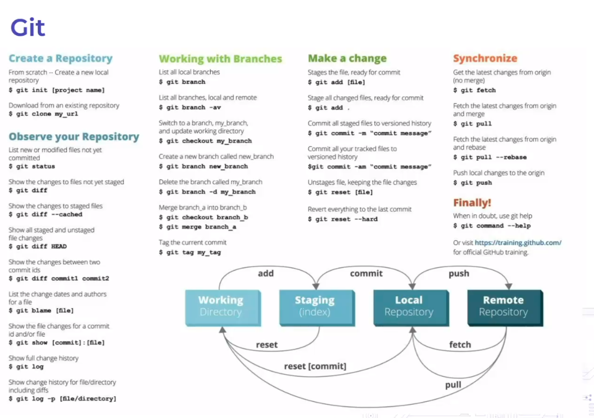

# Промышленная разработка на JS

## Установка node и npm

```
sudo apt install node
```

## Инициализация проекта

```
npm init
```

## Установка зависимостей

```
# установка для разработки
npm install webpack --save-dev
npm install webpack-cli --save-dev
```

## Разворачивание окружения

```
npm i
```

## Git

Проект создан Линусом Торвальдсом для управления разработки ядра Linux. 
Это распределенная система контроля версий.




Git hooks применяются для автоматизации определенных действий и проверок при работе с репозиторием Git. Они позволяют выполнять скрипты или команды на определенных этапах работы с репозиторием, таких как коммит, отправка изменений на сервер и другие.

Применение git hooks может быть полезным для следующих задач:

1. Проверка кода перед коммитом: Можно использовать pre-commit hook для запуска автоматической проверки кода на соответствие определенным стандартам или правилам, таким как стиль кодирования, отсутствие ошибок компиляции и т.д. Это помогает поддерживать качество кода в репозитории и предотвращает попадание некорректного кода в основную ветку.

2. Отправка изменений на сервер: Post-receive hook позволяет автоматически выполнять дополнительные действия после получения изменений на сервере. Например, можно использовать его для обновления веб-сайта, запуска автоматического тестирования или уведомления о новых изменениях.

3. Интеграция с CI/CD: Git hooks могут быть использованы для интеграции с системами непрерывной интеграции и доставки (CI/CD). Например, можно настроить pre-push hook для запуска автоматических тестов перед отправкой изменений на сервер CI/CD.

4. Запуск скриптов перед или после определенных команд Git: Git hooks могут быть использованы для запуска скриптов перед или после выполнения определенных команд Git, таких как git merge или git pull. Например, можно использовать pre-merge hook для проверки конфликтов перед слиянием веток.

В целом, git hooks позволяют автоматизировать и контролировать определенные действия при работе с репозиторием Git, что улучшает процесс разработки и поддержки кода.


